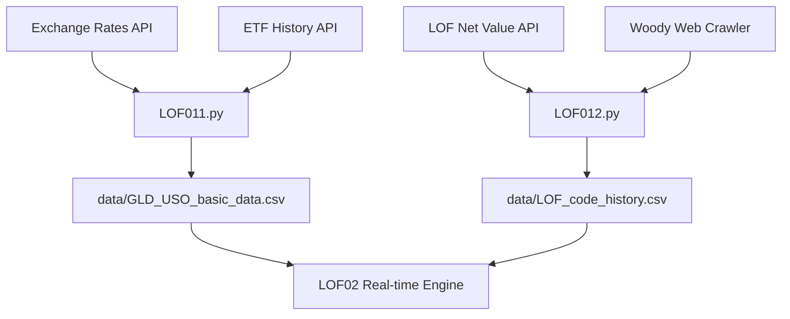

# CodexLOFarb System Architecture

Detailed mapping of the data flow and module interdependencies.

## 1. Backend Data Flow (Pre-market)

## 2. Real-time Service (LOF02)

`LOF02_fetch_trade_data.py` acts as the central hub:
- **Port 5000**: Main API entry point.
- **IBReader**: Handles US ETF quotes via TWS API.
- **SinaFuturesReader**: CMS futures and domestic silver SSE streams.
- **LOFPriceReader**: A-share LOF quotes via QMT or Sina fallback.

## 3. UI Generation (LOF03)

`LOF03_generate_monitor_html.py` orchestrates three sub-modules:
- **LOF031 (ConfigManager)**: Parses `lof_config.yaml`.
- **LOF032 (DataProcessor)**: Cleans and aligns historical CSV data into pandas DataFrames.
- **LOF033 (HtmlGenerator)**: Injects data and styles into the final HTML monitor.

## 4. Key Configuration: `lof_config.yaml`

Contains fund-specific metadata:
- `holdings`: Equity/Cash ratio.
- `valuation_portfolio`: Weighted ETF components.
- `future_hedging`: Futures symbols for hedging.
- `trade_etf`/`trade_future`: Target symbols for execution.
