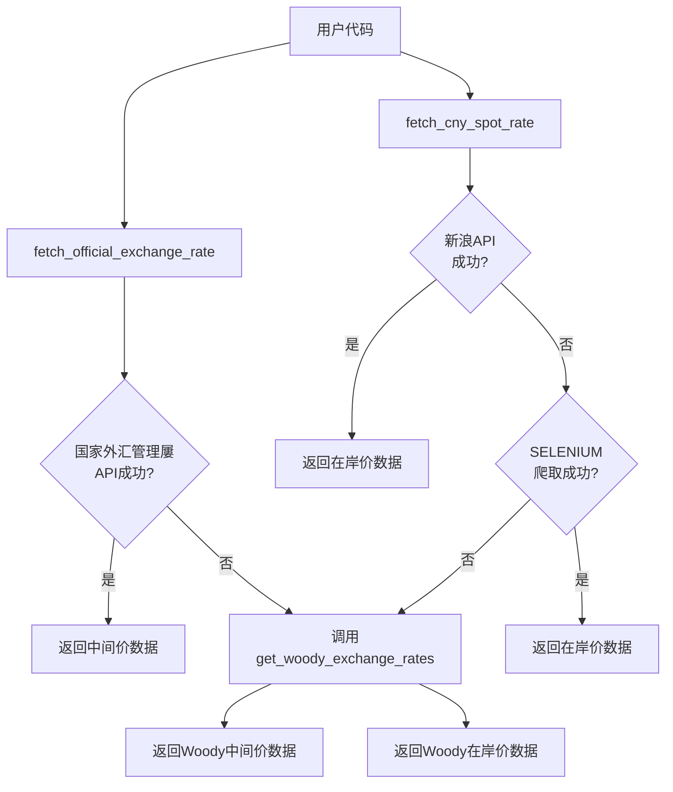

13# 汇率获取功能说明

## 概述

本文档详细说明项目中人民币汇率的获取功能，包括中间价和在岸价的获取方式数据源优先级以及函数之间的关系?

## 实现架构

### 核心文件

| 文件路径 | 功能描述 |
|---------|--------|
| `readers/data_fetcher.py` | 核心数据获取模块，负责汇率数据的获取 |

## 汇率获取函数

### 1. 人民币中间价获取

**函数**: `fetch_official_exchange_rate(self, date=None)`

**功能**: 获取人民币兑美元的中间价

**数据源优先级**:
1. **国家外汇管理屢** (优先)
   - 接口: `https://www.chinamoney.com.cn/r/cms/www/chinamoney/data/fx/ccpr.json`
   - 优势: 官方数据源，权威可靠

2. **Woody网页** (兜底)
   - 接口: `https://palmmicro.com/woody/res/sz159518cn.php`
   - 优势: 作为备份，确保数据获取的可靠?

**返回格式**:
```python
{
    '日期': '2026-04-16',
    '人民币中间价': 6.8616,
    '来源': '国家外汇管理屢'  # ?'Woody网页'
}
```

### 2. 人民币在岸价获取

**函数**: `fetch_cny_spot_rate(self)`

**功能**: 获取人民币兑美元的在岸价

**数据源优先级**:
1. **新浪财经API** (优先)
   - 接口: `https://hq.sinajs.cn/list=fx_susdcny`
   - 优势: 实时性高，数据更新频?
   - 注（2026-08-02 实测）：该接口为 **HTTPS**；同域 `hq.sinajs.cn` 的 A股盘口行情（HTTP）从美国 ARM 不可达，但**此在岸价 HTTPS 接口从 ARM 实测可达**，故美国侧实时在岸价可用。腾讯在岸价见 §4 可作备份源。

2. **Selenium网页爬取** (备?
   - 接口: `https://finance.sina.com.cn/money/forex/hq/USDCNY.shtml`
   - 优势: 当API接口失败时的备方?

3. **Woody网页** (兜底)
   - 接口: `https://palmmicro.com/woody/res/sz159518cn.php`
   - 优势: 作为朢终兜底，确保数据获取的可靠?

**返回格式**:
```python
{
    '日期': '2026-04-16',
    '时间': '12:06:01',
    '人民币在岸价': 6.8177,
    '朢高价': 6.8179,
    '朢低价': 6.8188,
    '买入?: 6.8169,
    '卖出?: 6.8185,
    '成交?: '30.0000000000',
    '货币?: '在岸人民?,
    '来源': 'API接口'  # ?'Selenium网页爬取' ?'Woody网页'
}
```

### 3. Woody网页汇率获取

**函数**: `get_woody_exchange_rates(self)`

**功能**: 从Woody网页爬取汇率数据，作为兜底方?

**数据?*:
- 接口: `https://palmmicro.com/woody/res/sz159518cn.php`
- 优势: 提供两种汇率数据，稳定高

**返回格式**:
```python
{
    'USDCNY': {
        'rate': 6.8177,  # 在岸?
        'time': '12:06:01',
        'name': '在岸人民?
    },
    'USCNY': {
        'rate': 6.8616,  # 中间?
        'time': '09:15:00',
        'name': '人民币中间价'
    }
}
```

### 4. 腾讯财经汇率（实测可用，2026-08-02 新增，待接入代码）

**情报**：腾讯财经行情接口 `https://qt.gtimg.cn` 除 A股/港股/美股/期货外，**也能取人民币汇率（在岸 CNY）**，可作新浪在岸价的备份源，尤其利于美国 ARM 部署（见 `093_3` / `093_5`）。

**在岸人民币 CNY（可用）**：
- 接口：`https://qt.gtimg.cn/q=fxUSDCNY`
- 返回示例：`v_fxUSDCNY="310~美元人民币~USDCNY~6.7524~0~20260801030002~6.7520~6.7510~..."`
- 时间戳：`20260801030002` = 2026-08-01 03:00:02，证明是带时间的实时报价
- 响应延迟：本机(中国) ~0.2–0.25s；ARM(美国) ~0.7–1.0s（同端点期货实测）
- 接入建议：在 `fetch_cny_spot_rate()` 的新浪之后、Woody 之前加一层腾讯兜底（纯 API、无需账号），提升美国侧鲁棒性。**当前代码未接，先记录能力，待东哥拍板接入。**

**离岸人民币 CNH（该端点不可用）**：
- 试探 `fxUSDCNH` / `fxHKCNH` / `fx_susdcnh` 等均返回 `v_pv_none_match` → 腾讯 `qt.gtimg.cn` **不提供离岸 CNH**。
- 离岸价仍只靠新浪 `fx_susdcnh`（HTTP，美国侧失败、非关键），暂无需兜底。

> 小结：上文 §2 在岸价优先级现为「新浪 API → Selenium → Woody」。腾讯在岸价是新增的一层实时兜底候选，尚未写入代码（避免改动数据红线）。

## 函数调用关系



## 错误处理机制

1. **多层异常捕获**:
   - 对每个数据源的调用都添加了异常捕?
   - 确保程序在任何情况下都能正常运行

2. **详细的日志记?*:
   - 使用Python标准库`logging`记录详细的日志信?
   - 便于调试和监控数据获取过?

3. **优雅降级**:
   - 当高优先级数据源失败时，自动降级到低优先级数据源
   - 确保在网络不稳定或API接口变更时仍能获取到汇率数据

## 使用示例

### 1. 获取人民币中间价

```python
from readers.data_fetcher import data_fetcher

# 获取人民币中间价
middle_rate_data = data_fetcher.fetch_official_exchange_rate()

if middle_rate_data:
    print(f"人民币中间价: {middle_rate_data['人民币中间价']} (来源: {middle_rate_data['来源']})")
else:
    print("无法获取人民币中间价")
```

### 2. 获取人民币在岸价

```python
from readers.data_fetcher import data_fetcher

# 获取人民币在岸价
spot_rate_data = data_fetcher.fetch_cny_spot_rate()

if spot_rate_data:
    print(f"人民币在岸价: {spot_rate_data['人民币在岸价']} (来源: {spot_rate_data['来源']})")
    print(f"更新时间: {spot_rate_data['时间']}")
else:
    print("无法获取人民币在岸价")
```

### 3. 直接使用Woody网页数据

```python
from LOF013_woody_web_crawler import WoodyWebCrawler

# 初始化爬?
crawler = WoodyWebCrawler()

# 获取汇率数据
exchange_rates = crawler.get_woody_exchange_rates()

if exchange_rates:
    if 'USDCNY' in exchange_rates:
        print(f"在岸? {exchange_rates['USDCNY']['rate']} (时间: {exchange_rates['USDCNY']['time']})")
    if 'USCNY' in exchange_rates:
        print(f"中间? {exchange_rates['USCNY']['rate']} (时间: {exchange_rates['USCNY']['time']})")
else:
    print("无法从Woody网页获取汇率数据")
```

## 总结

本实现过多层数据源和自动降级机制，确保了汇率数据的稳定获取即使在网络不稳定或API接口变更的情况下，系统仍能过兜底方案获取到汇率数据，提高了程序的可靠性和稳定性，为套利程序提供了保障
